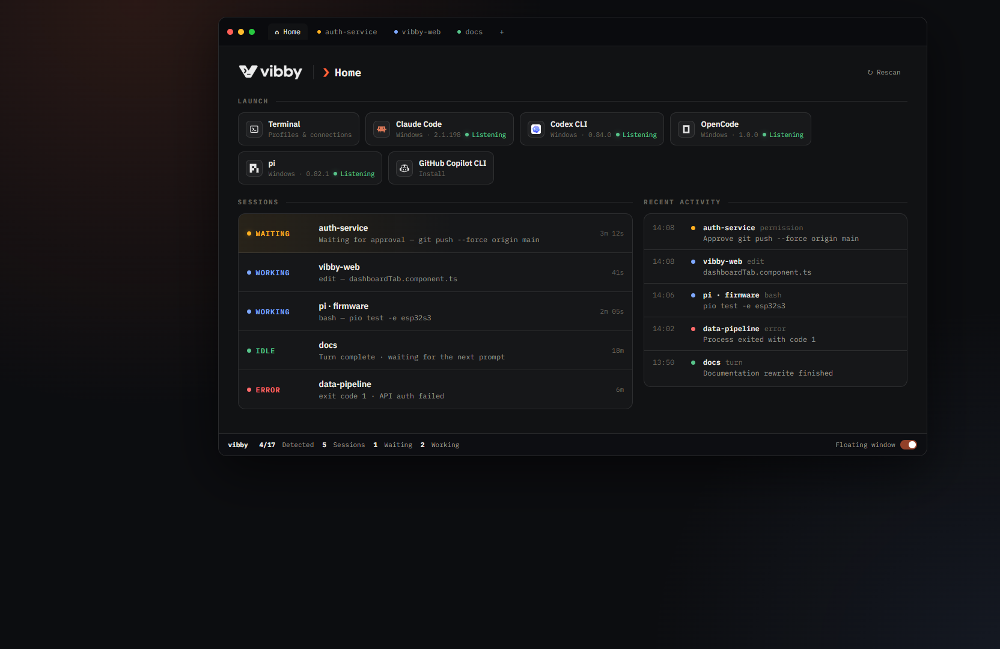
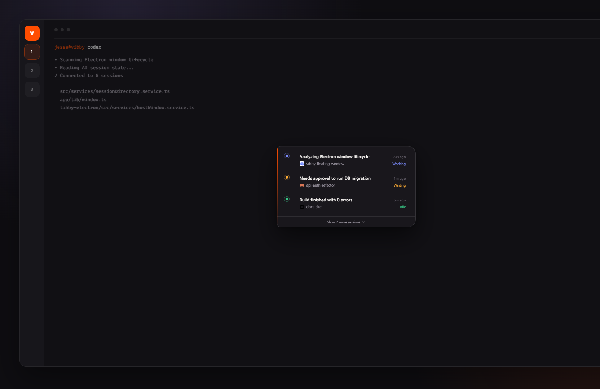

# Vibby

**A terminal built for AI coding CLIs.**

Vibby discovers the AI agents on your machine, launches them in one click, watches what each session is doing, and nudges you when something needs a human. It is a fork of [Tabby](https://github.com/Eugeny/tabby) with a first-class AI session dashboard — the rest of the terminal stays familiar: SSH, serial, splits, themes, profiles.

[简体中文](./README.zh-CN.md)

<p align="center">
  
</p>

<p align="center">
  
</p>

## Why Vibby

Running several Claude / Codex / OpenCode / Pi sessions at once turns into tab babysitting: which one is waiting on you, which one is still working, which one already died. Vibby puts that board on the Home tab.

- **Discover** AI CLIs on Windows, macOS, Linux, and WSL
- **Launch** a monitored session (or a plain terminal) from the dashboard
- **Listen** to session state with native hooks / adapters — not by scraping TUI noise
- **Surface** Waiting / Working / Idle / Error with live captions
- **Pin** a floating window so you can keep an eye on agents while you work elsewhere

## Monitoring

| CLI | Role |
|---|---|
| **Claude Code** | Full monitoring via injected hooks |
| **Codex CLI** | Full monitoring when hooks are available |
| **OpenCode** | Full monitoring via local SSE |
| **pi** | Full monitoring via extension hooks (`≥ 0.82.1`) |
| GitHub Copilot CLI, Cursor Agent, Cline, Qwen Code, Kimi Code, Grok Build, Kiro, Kilo, Crush, Factory Droid, Devin, Amp, Antigravity, … | Detect + one-click launch |

Cards marked **Listening** are fully monitored. Everything else can still be launched; Vibby just will not invent state it cannot see.

## Features

- Always-on **Home** dashboard: Launch strip, Sessions board, Recent activity
- Desktop notifications when a session flips into **Waiting**
- Optional **floating window** for multi-session glanceability
- Full Tabby terminal stack underneath: local shells, WSL, SSH, Telnet, serial, splits, profiles, themes

## Install

Grab the latest build from [GitHub Releases](https://github.com/UniRound-Tec/vibby/releases).

Windows, macOS, and Linux packages are published from this fork.

## Develop

```bash
yarn
yarn build:typings
yarn watch   # terminal 1 — plugins + app
yarn start   # terminal 2 — Electron (TABBY_DEV=1)
```

Notes:

- Node 22+ recommended (CI uses 22; 24 works locally)
- On Windows, VS 2022 Spectre-mitigated libraries are required to build native modules
- Changes under `app/src` need an app webpack rebuild if `yarn watch` is not already covering them

## Upstream

Vibby is based on [Tabby](https://github.com/Eugeny/tabby) by Eugeny and contributors. Plugin package names still use the `tabby-*` prefix so the loader and community plugins keep working; the product name you see is **Vibby**.
