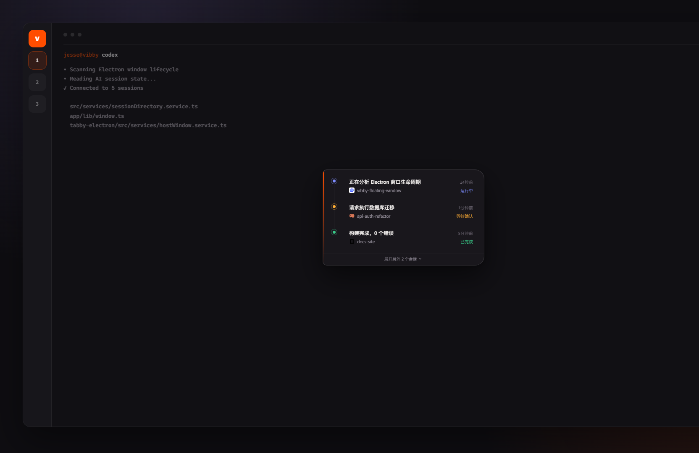

# Vibby

**为 AI 编程 CLI 特化的终端。**

Vibby 会自动发现本机上的 AI CLI，一键开会话，实时看每个会话在干什么，并在需要人出手时提醒你。它基于 [Tabby](https://github.com/Eugeny/tabby) 二次开发，保留熟悉的终端能力（SSH、串口、分屏、主题、配置集），并加上一等公民的 AI 会话看板。

[English](./README.md)

<p align="center">
  
</p>

<p align="center">
  
</p>

## 为什么是 Vibby

同时开多个 Claude / Codex / OpenCode / Pi 会话时，最常见的问题是：谁在等你、谁还在跑、谁已经挂了。Vibby 把这块看板放在 Home。

- **发现**：扫描 Windows / macOS / Linux / WSL 上的 AI CLI
- **启动**：从看板一键开会话，或打开普通终端
- **监听**：用原生 hooks / 适配器拿状态，而不是硬解析 TUI
- **呈现**：Waiting / Working / Idle / Error 四态 + 实况字幕
- **置顶**：可选悬浮窗，切去做别的事时仍能余光盯着 agent

## 监听能力

| CLI | 说明 |
|---|---|
| **Claude Code** | 完整监听（自动注入 hooks） |
| **Codex CLI** | 完整监听（hooks 可用时） |
| **OpenCode** | 完整监听（本地 SSE） |
| **pi** | 完整监听（扩展 hooks，需 `≥ 0.82.1`） |
| GitHub Copilot CLI、Cursor Agent、Cline、Qwen Code、Kimi Code、Grok Build、Kiro、Kilo、Crush、Factory Droid、Devin、Amp、Antigravity 等 | 可探测 + 一键启动 |

标有 **已接入（Listening）** 的卡片表示完整监听。其余仍可启动，只是不会伪造看不到的状态。

## 功能

- 常驻 **Home** 看板：Launch 启动条、Sessions 会话板、Recent activity
- 会话进入 **Waiting** 时发送桌面通知
- 可选 **悬浮窗**，多会话余光可见
- 底层仍是完整 Tabby 终端：本地 shell、WSL、SSH、Telnet、串口、分屏、配置集、主题

## 安装

从 [GitHub Releases](https://github.com/UniRound-Tec/vibby/releases) 下载对应平台安装包。

## 开发

```bash
yarn
yarn build:typings
yarn watch   # 终端 1 — 插件与 app 监听编译
yarn start   # 终端 2 — Electron（TABBY_DEV=1）
```

说明：

- 建议 Node 22+（CI 使用 22；本机 24 可用）
- Windows 构建原生模块需要 VS 2022 Spectre 缓解库
- 若改动 `app/src` 且 watch 未覆盖，需单独重编 app webpack

## 上游

Vibby 基于 Eugeny 与社区维护的 [Tabby](https://github.com/Eugeny/tabby)。插件包名仍保留 `tabby-*` 前缀，以便加载器与社区插件继续工作；用户看到的产品名是 **Vibby**。
